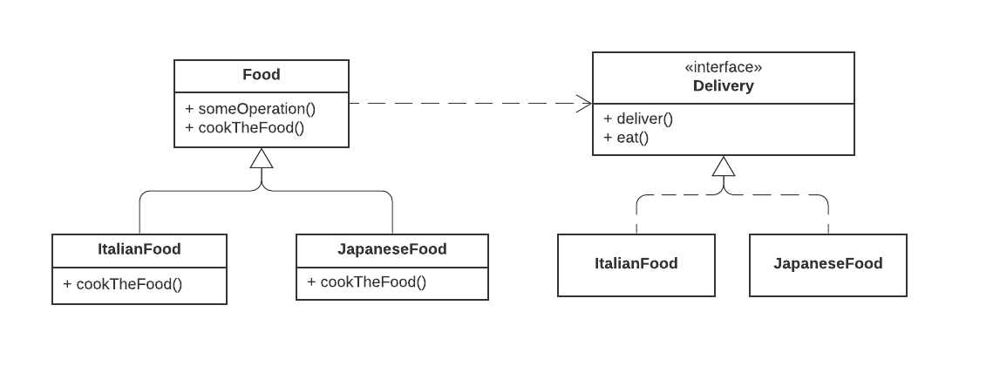

| Data |Versão| Autor | Descrição |
| ---- | ---- | ----- | --------- |
| 2020/11/14 | 1.0 | Dâmaso e Letícia | Criação do Documento |

# Estudo Digirido - GoFs Criacional

## Factory Method 

O **Factory Method** é um padrão de projeto que permitem a criação de objetos com atributos e métodos variados em uma superclasse (interface) especifíca e abstrata que permite a criação e alteração dos tipos de objetos, de acordo com a necessidade do projeto.
 
Exemplo: Suponhamos que temos em um projeto, é especificado apenas a entrega de comidas italianas, porém existem propostas e requisições de clientes por comida japonesa. Porém o seu projeto está todo especificado para a entrega de comidas italianas. Sendo assim, necessario toda uma refatoração do código para que ele se adeque a nova realidade do problema. Imagine então, que seja necessário a adição de mais um tipo de comida, aumentando assim a complexidade do código fazendo com que todo o projeto fique cada vez mais complexo e muito menos coeso.

Com o **Factory Method** é declarado uma superclasse `Comida` que trata de criar objetos do tipo comida, sendo as subclasses formas de se sobrescrever a superclasse com os seus próprios tipos:

Sendo assim, o último ponto ser destacado é, como essa implementação acontece: 

1. O `Produto` declara a interface.
2. Os produtos concretos são versões diferentes da classe `Produto`.
3. A classe `Criador` implementa o método fabrica, e retorna o método que corresponda ao `Produto`.
4. Os criadores concretos sobrescrevem o método fabrica para retornar tipos diferentes de objetos.

### Pontos positivos

- Evitar acomplamentos firmes entre o criador e os produtos.
- *Princípio de responsabilidade única*. Você pode realizar a manutenção do código sem afetar os outros componentes diretamente.
- *Princípio aberto/fechado*. Você pode adicionar novos componentes ao código sem quebrar ou afetar os outros componentes já existentes.

### Pontos negativos

- O código pode ficar muito complexo pelo número de subclasses que podem ser necessárias para a implementação do código. O ideal é a implementação em uma estrutura com classes criadoras já existentes.

### Viabilidade

Para ser implementado em nosso projeto, o **Factory Method** deve ser estruturado para construir e criar objetos diferentes que pertencem a uma mesma categoria. Devido ao escopo do projeto, isso não é possível de ser implementado visto que temos apenas tipos bem definidos de objetos, sendo eles `Recipe` e `RecipeBook`.

## Abstract Method

### Pontos positivos

### Pontos negativos

### Viabilidade

## Singleton

### Pontos positivos

### Pontos negativos

### Viabilidade

# Referências
