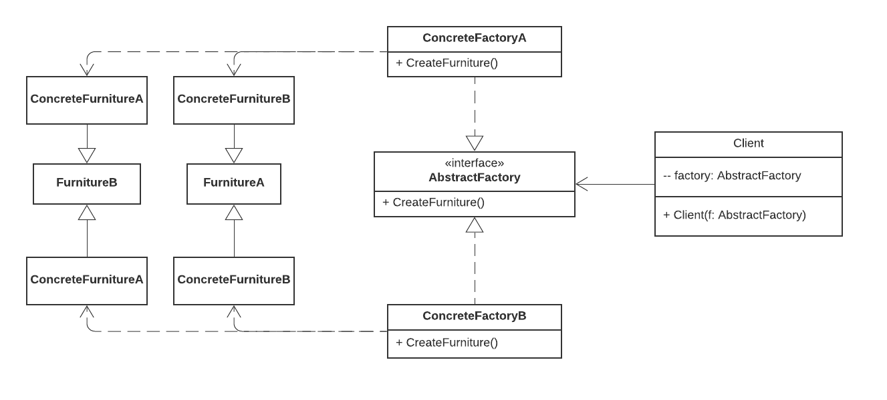
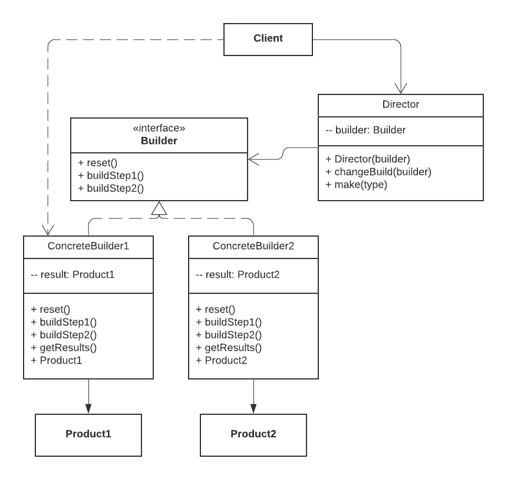
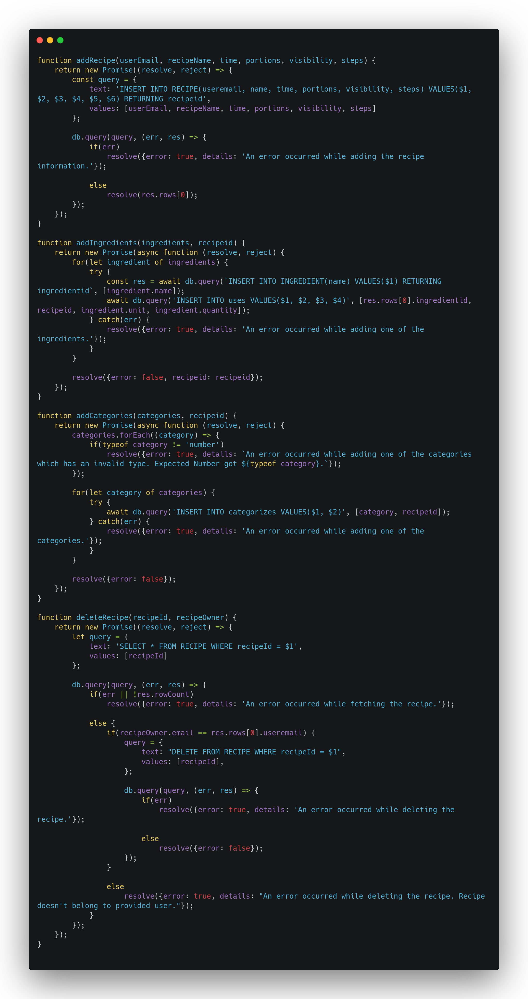
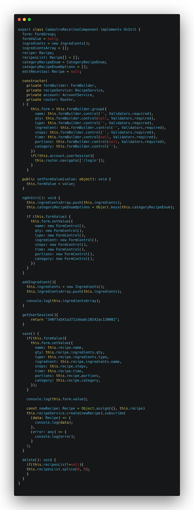

| Data |Versão| Autor | Descrição |
| ---- | ---- | ----- | --------- |
| 2020/11/14 | 1.0 | Dâmaso e Letícia | Criação do Documento |

# Estudo Dirigido - GoFs Criacional

## Factory Method 

O **Factory Method** é um padrão de projeto que permitem a criação de objetos com atributos e métodos variados em uma superclasse (interface) especifíca e abstrata que permite a criação e alteração dos tipos de objetos, de acordo com a necessidade do projeto.
 
Exemplo: Suponhamos que temos em um projeto, é especificado apenas a entrega de comidas italianas, porém existem propostas e requisições de clientes por comida japonesa. Porém o seu projeto está todo especificado para a entrega de comidas italianas. Sendo assim, necessario toda uma refatoração do código para que ele se adeque a nova realidade do problema. Imagine então, que seja necessário a adição de mais um tipo de comida, aumentando assim a complexidade do código fazendo com que todo o projeto fique cada vez mais complexo e muito menos coeso.

Com o **Factory Method** é declarado uma superclasse `Comida` que trata de criar objetos do tipo comida, sendo as subclasses formas de se sobrescrever a superclasse com os seus próprios tipos:

Sendo assim, o último ponto ser destacado é, como essa implementação acontece: 

1. O `Produto` declara a interface.
2. Os produtos concretos são versões diferentes da classe `Produto`.
3. A classe `Criador` implementa o método fabrica, e retorna o método que corresponda ao `Produto`.
4. Os criadores concretos sobrescrevem o método fabrica para retornar tipos diferentes de objetos.

### Pontos positivos

- Evitar acomplamentos firmes entre o criador e os produtos.
- *Princípio de responsabilidade única*. Você pode realizar a manutenção do código sem afetar os outros componentes diretamente.
- *Princípio aberto/fechado*. Você pode adicionar novos componentes ao código sem quebrar ou afetar os outros componentes já existentes.

### Pontos negativos

- O código pode ficar muito complexo pelo número de subclasses que podem ser necessárias para a implementação do código. O ideal é a implementação em uma estrutura com classes criadoras já existentes.

### Viabilidade

Para ser implementado em nosso projeto, o **Factory Method** deve ser estruturado para construir e criar objetos diferentes que pertencem a uma mesma categoria. Devido ao escopo do projeto, isso não é possível de ser implementado visto que temos apenas tipos bem definidos de objetos, sendo eles `Recipe` e `RecipeBook`.

## Abstract Factory

O **Abstract Factory** é uma versão "mais escalável" do Factory Method, nele é possível que se crie e instancie familias de objetos relacionados. 

Exemplo: Suponhamos que temos uma fabrica de móveis e nelas são feitas cadeiras, mesas e sofás. Além disso são feitos estilos de móveis, Vitorianos, Modernos e Clássicos. Sendo assim diversas variações de móveis dentro de uma família de objetos diferentes. Nesse caso a aplicação do padrão **Abstract Factory** mostra de uma forma simples a aplicação escalável desse exemplo.

1. São específicados interfaces para cada móvel específico, com seus respectivos métodos.
2. São implementados interfaces abstratas para cada estilos de móvel utilizado pela fábrica.
3. A fábrica implementa métodos que são sobrescritos pelas classes concretas de construção de estilo, e é chama pelo cliente do software que executa tudo.

### Pontos positivos

- Certeza sobre compatibilidade entre os componentes.
- Evitar vínculo forte entre produtos concretos e código cliente.
- *Princípio de responsabilidade única*. Você pode realizar a manutenção do código sem afetar os outros componentes diretamente.
- *Princípio aberto/fechado*. Você pode adicionar novos componentes ao código sem quebrar ou afetar os outros componentes já existentes.

### Pontos negativos

- A complexidade do código pode aumentar devido a quantidade de classes e interfaces criadas no projeto.

### Viabilidade

Assim como Factory Method, a aplicação contem um escopo muito pequeno fazendo com que seja um tanto quanto inviável para a aplicação deste padrão de projeto. Porém com uma certa escalabilidade sobre a aplicação pode ser que o padrão seja aplicado sobre a categorização das receitas culinárias presentes no projeto.

## Builder

O **Builder** tem como objetivo realizar a construção de objetos complexos atráves de métodos que constroem partes do objeto e incrementam funcionalidades sobre o objeto.

Exemplo: Imaginemos que existe uma classe que implementa a construção de uma casa. Porém os componentes de uma casa podem variar de acordo com o gosto do cliente, a casa pode ter piscina, garagem ou não. O **Builder** então define diversos métodos que constroem parte da casa, montando uma estrutura eficiente para personalizar o objeto Casa.

1. É necessário declarar uma interface `Builder` com todas os métodos de construção das etapas do projeto.
2. Definir também uma classe `Diretor` para liderar todos os `Builders`.
3. Definir construtores concretos que irão interagir com a interface Builder principal e que irão gerar o produto final.

### Pontos positivos

- É possível construir objetos passo a passo, assim como adiar etapas de construção ou rodar etapas recursivamente.
- É possível realizar a construção de diversos tipos de objetos com um único código
- *Princípio de responsabilidade única*. Você pode realizar a manutenção do código sem afetar os outros componentes diretamente.

### Pontos negativos

- A complexidade do código aumenta visto que o padrão exige a criação de multiplas interfaces.

### Viabilidade

Foi aplicado uma pequena implementação do padrão de projeto dentro da criação de receitas culinárias, foi adicionado uma adaptação para que seja possível adicionar quantos ingredientes quanto queira dentro de uma única receita culinária.

**Exemplo de aplicação Backend**: 

[RecipeRepository.js](https://github.com/UnBArqDsw/2020.1_G3_RecipeBuk_Backend/blob/dev/src/Repository/RecipesRepository.js)

**Exemplo de aplicação Frontend**:

[cadastro-receitas.component.ts](https://github.com/UnBArqDsw/2020.1_G3_RecipeBuk_Frontend/blob/dev/src/app/cadastro-receitas/cadastro-receitas.component.ts)

## Prototype

### Pontos positivos

### Pontos negativos

### Viabilidade

# Referências
