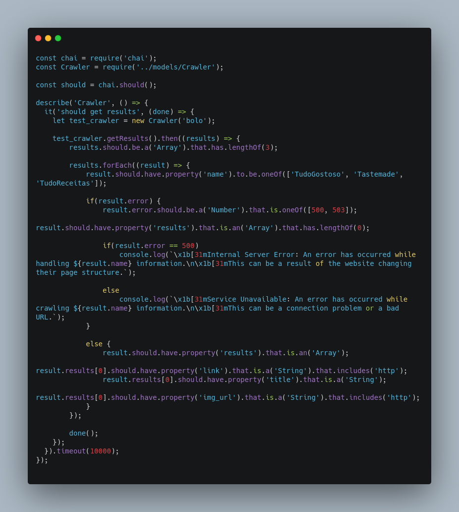

| Data |Versão| Autor | Descrição |
| ---- | ---- | ----- | --------- |
| 2020/11/17 | 0.1 | Eduardo Lima | Criação do Documento |
| 2020/11/17 | 0.2 | Larissa Sales | Adição de descrição e Referências |
| 2020/11/17 | 0.3 | Luis Taira | Adição de Mocha e Chai |
| 2020/11/17 | 0.3 | Eduardo Lima | Adição de links para arquivos citados |

# Reutilização de Software - Backend

## Node.js

Para a implementação do Backend utilizamos o Nodejs. Nodejs é um runtime assíncrono orientado a eventos em JavaScript, feito para criar aplicações network escaláveis, possuindo uma vasta variedade de frameworks, possibilitando um desenvolvimento rápido e de qualidade com a reutilização de software.

Utilizamos a reutilização de software através de frameworks e serviços em nosso backend. São eles:

* Express: Framework de aplicação web para NodeJs, utilizado para criar API de maneira eficiente.
    * Hot-spot: Possuímos implementado em nossa aplicação o método Router do express, que possibilita a criação dinâmica de rotas HTTP
        

        [Router.js](https://github.com/UnBArqDsw/2020.1_G3_RecipeBuk_Backend/blob/dev/src/routes/Router.js)
        
    * Frozen-spot: Inicializar uma aplicação web via Express

        
        

        [index.js](https://github.com/UnBArqDsw/2020.1_G3_RecipeBuk_Backend/blob/dev/index.js)

* Mocha e Chai

São duas bibliotecas que tranalham em conjunto e permitem a criação de testes unitários da aplicação.
Quando rodado o comando `npm test`, são rodados todos os testes específicados.

Segue um exemplo da utilizalção no projeto

[crawlerTest.js](https://github.com/UnBArqDsw/2020.1_G3_RecipeBuk_Backend/blob/dev/src/tests/crawlerTest.js)

# Referências

[1] Introdução Express/Node. Disponível em: <<https://developer.mozilla.org/pt-BR/docs/Learn/Server-side/Express_Nodejs/Introdu%C3%A7%C3%A3o>>. Acesso em: 17 nov. 2020.