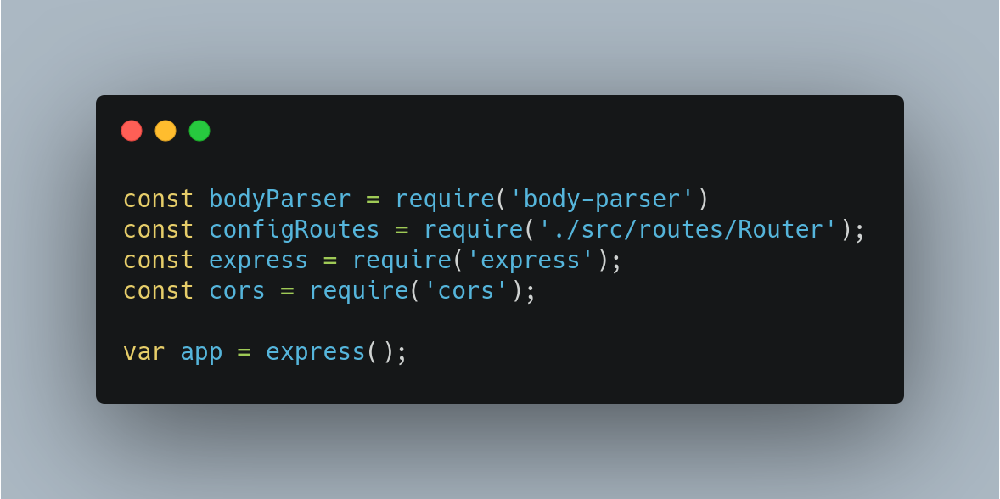

| Data |Versão| Autor | Descrição |
| ---- | ---- | ----- | --------- |
| 2020/11/17 | 0.1 | Eduardo Lima | Criação do Documento |
| 2020/11/17 | 0.2 | Larissa Sales | Adição de descrição e Referências |
| 2020/11/17 | 0.3 | Eduardo Lima | Adição de links para arquivos citados |
| 2020/11/17 | 0.4 | Luis Taira | Adição de Mocha e Chai |
| 2020/11/17 | 0.5 | Eduardo Lima | Adição do tópico getUser |
| 2020/11/18 | 0.6 | Samuel Pereira | Adição do Crawler |
| 2020/11/18 | 0.7 | Samuel Pereira | Atualização do Crawler |

# Reutilização de Software - Backend

## Node.js

Para a implementação do Backend utilizamos o Nodejs. Nodejs é um runtime assíncrono orientado a eventos em JavaScript, feito para criar aplicações network escaláveis, possuindo uma vasta variedade de frameworks, possibilitando um desenvolvimento rápido e de qualidade com a reutilização de software.

Utilizamos a reutilização de software através de frameworks e serviços em nosso backend. São eles:

## Express 

Framework de aplicação web para NodeJs, utilizado para criar API de maneira eficiente.

* Hot-spot: Possuímos implementado em nossa aplicação o método Router do express, que possibilita a criação dinâmica de rotas HTTP

    

    [Router.js](https://github.com/UnBArqDsw/2020.1_G3_RecipeBuk_Backend/blob/dev/src/routes/Router.js)

* Frozen-spot: Inicializar uma aplicação web via Express
        
    

    [index.js](https://github.com/UnBArqDsw/2020.1_G3_RecipeBuk_Backend/blob/dev/index.js)

## getUser

getUser é um método existente no repositório [UserRepository.js](https://github.com/UnBArqDsw/2020.1_G3_RecipeBuk_Backend/blob/dev/src/Repository/UserRepository.js), sendo aplicado como um serviço de autenticação reutilizado em todo o Backend. Sua função é lidar com a verificação do token de autenticação do usuário , além de retornar suas informações. Atua como Frozen-spot.

Exemplo de aplicação no arquivo [BookRoutes.js](https://github.com/UnBArqDsw/2020.1_G3_RecipeBuk_Backend/blob/dev/src/routes/BookRoutes.js)

## Mocha e Chai

São duas bibliotecas que tranalham em conjunto e permitem a criação de testes unitários da aplicação.
Quando rodado o comando `npm test`, são rodados todos os testes específicados.

Segue um exemplo da utilizalção no projeto

[crawlerTest.js](https://github.com/UnBArqDsw/2020.1_G3_RecipeBuk_Backend/blob/dev/src/tests/crawlerTest.js)

## Crawler
Crawler é um módulo para NodeJS que tem como funcionalidade a realização de Web Scraping e Web Crawling, permitindo a obtenção de informações de páginas da web de forma sistematizada.  

No ponto de vista de reutilização de software do Crawler no Recipebuk, a utilização do Crawler simplifica o desenvolvimento do projeto pois justamente fornece essas funcionalidades de *Web Scraping* e *Web Crawling*, a qual é utilizada no projeto para a obtenção da informações de receitas de diversos websites. A ausência desse módulo, ocasionaria na necessidade de implementação das seguintes funcionalidades:
- Obtenção de informações de páginas através de requisições HTTP;
- *Parsing* das informações adquiridas, a qual é resolvido pelo Crawler através da disponibilização do Cheerio, uma implementação simplificada do JQuery para servidores;
- Agendamento e sincronização de todas as requisições para o fornecimento da resposta do servidor, onde o Crawler soluciona através do fornecimento de uma fila de requisições a qual possui um callback quando todas as requisições são finalizadas e processadas.  

No projeto, o Crawler atua como uma reutilização de código de caixa-branca, pois utilizamos a funcionalidade de *scraping* para adquirir informações de outros sites, a qual temos de definir como será feita a filtragem de dados em cada um dos websites alvos. Exemplo da utilização segue abaixo: 

- Hot spot: Implementação de tratamento de dados do website TudoGostoso
 
 [Crawler.js](https://github.com/UnBArqDsw/2020.1_G3_RecipeBuk_Backend/blob/dev/src/models/Crawler.js)
 
# Referências

[1] Introdução Express/Node. Disponível em: <<https://developer.mozilla.org/pt-BR/docs/Learn/Server-side/Express_Nodejs/Introdu%C3%A7%C3%A3o>>. Acesso em: 17 nov. 2020.
