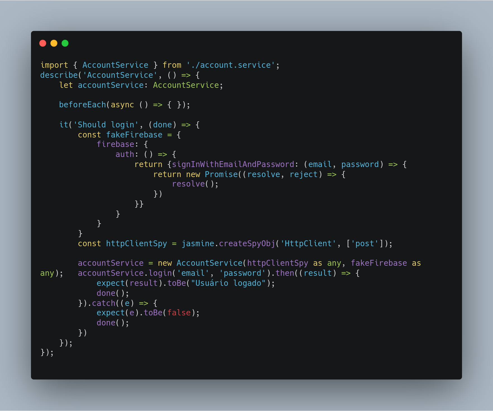

| Data |Versão| Autor | Descrição |
| ---- | ---- | ----- | --------- |
| 2020/11/17 | 0.1 | Samuel Pereira | Criação do documento e inclusão do Angular |
| 2020/11/17 | 0.2 | Larissa Sales | Adição de descrição e Referências |
| 2020/11/20 | 0.3 | Larissa Sales | Adição de especificações do Jasmine |

# Reutilização de Software - Frontend

## Angular

&emsp;&emsp;&emsp;&emsp;Angular é um framework de código-aberto para desenvolvimento de aplicações web baseado em Typescript, utilizando-se de uma arquitetura de hierarquia de componentes.

&emsp;&emsp;&emsp;&emsp;No ponto de vista de reutilização de software do Angular no RecipeBük, a utilização do Angular nos poupa da implementação de funcionalidades como também simplifica a utilização das mesmas, esses sendo:
 - Implementação e facilitação da criação de elementos e páginas dinâmicas;
 - Implementação da sincronização de mudanças dos dados apresentados na view do cliente com a camada de dados do cliente e vice-versa;
 - Implementação de uma série de funcionalidades fornecidas como serviços.
 
 &emsp;&emsp;&emsp;&emsp;O framework Angular atua como uma reutilização de código de caixa-cinza, apresentando frozen spots - como os serviços que estão a disposição do usuário - e hot spots - como a arquitetura de componentes, a qual permite que o desenvolvedor crie os seus próprios componentes, como também a criação de serviços além dos serviços já nativos do Angular - apresentados com exemplo abaixo:

 - Hot spot: Implementação de componente Homepage
 
 [homepage.component.ts](https://github.com/UnBArqDsw/2020.1_G3_RecipeBuk_Frontend/blob/dev/src/app/homepage/homepage.component.ts)

 - Frozen spot: Utilização de serviço HttpClient
 
[homepage.component.ts](https://github.com/UnBArqDsw/2020.1_G3_RecipeBuk_Frontend/blob/dev/src/app/homepage/homepage.component.ts)
 
 ## Jasmine

 O Jasmine é um framework de testes unitários para código JavaScript, com suporte para a prática BDD (_Behaviour-Driven Development_).

 Seu uso nos confere uma facilidade na implementação de testes unitários, de forma que é possível utilizar um mesmo padrão de código para testar diferentes funções implementadas no código.

- Hot spot: Teste da AccountService   
 
[account.service.spec.ts](https://github.com/UnBArqDsw/2020.1_G3_RecipeBuk_Frontend/blob/dev/src/app/services/account.service.spec.ts) 

 # Referências

[1] Frameworks e Padrões de Projeto. Disponível em: <<https://www.devmedia.com.br/frameworks-e-padroes-de-projeto/1111>>. Acesso em: 17 nov. 2020.

[2] ASIM. Code Craft. Jasmine & Karma. Disponível em: <<https://codecraft.tv/courses/angular/unit-testing/jasmine-and-karma/>>. Acesso em: 20 nov. 2020.
