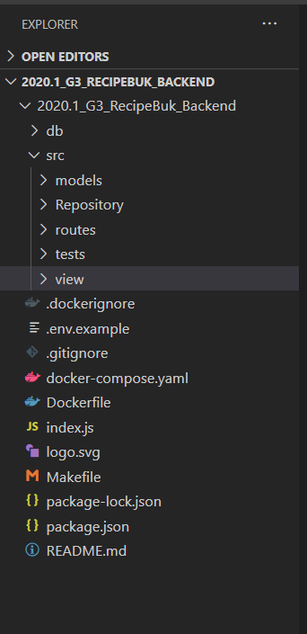

| Data |Versão| Autor | Descrição |
| ---- | ---- | ----- | --------- |
| 2020/11/14 | 1.0 | Dâmaso Júnio e Letícia Karla Araújo | Criação do Documento|

# Padrão de Arquitetura
Um padrão arquitetural é uma forma pré-estabelecida de resolver um problema já conhecido. Padrões capturam experiência existente e comprovada em
desenvolvimento de software, ajudando a promover boa prática de
projeto. O padrões arquiteturais têm como características:
* Um esquema de organização estrutural, fundamental para sistemas de software;
* Templates prontos que solucionam problemas arquiteturais recorrentes;
* Um conjunto de subsistemas prédefinidos, especificando suas
responsabilidades e incluindo regras e diretrizes para organizar as
relações entre eles.

O padrão escolhido pelo grupo foi o MVC.

## MVC
Model – view – controller (MVC) é um padrão de arquitetura de software para implementar interfaces de usuário. Ele divide um determinado aplicativo de software em três partes interconectadas, de modo a separar as representações internas das informações das formas como as informações são apresentadas ou aceitas pelo usuário.

### Model
Modelo é a ponte entre as camadas Visão (View) e Controle (Controller), consiste na parte lógica da aplicação, que gerencia o comportamento dos dados através de regras de negócios, lógica e funções. Esta fica apenas esperando a chamada das funções, que permite o acesso para os dados serem coletados, gravados e, exibidos.

[Ingredient.js](https://github.com/UnBArqDsw/2020.1_G3_RecipeBuk_Backend/blob/dev/src/models/Ingredient.js)
### View
Visão pode ser qualquer saída de representação dos dados, como uma tabela ou um diagrama. É onde os dados solicitados do Modelo (Model) são exibidos.

[UserRepository.js ](https://github.com/UnBArqDsw/2020.1_G3_RecipeBuk_Backend/blob/dev/src/Repository/UserRepository.js)
### Controller
Controle é o componente final da tríade, faz a mediação da entrada e saída, comandando a visão e o modelo para serem alterados de forma apropriada conforme o usuário solicitou através do mouse e teclado.

[Router.js ](https://github.com/UnBArqDsw/2020.1_G3_RecipeBuk_Backend/blob/dev/src/routes/Router.js)
## Referências Bibliográficas
[1] SERRANO, Milene. Arquitetura e Desenho de Software: estilos e padrões arquiteturais i. ESTILOS E PADRÕES ARQUITETURAIS I. Disponível em: <<https://aprender3.unb.br/pluginfile.php/26819/mod_label/intro/Arquitetura%20e%20Desenho%20de%20Software%20-%20Aula%20Estilos%20e%20Padr%C3%B5es%20Arquiteturais%20I%20-%20Profa.%20Milene.pdf>>. Acesso em: 14 nov. 2020.

[2] RAMOS, Allan. O que é MVC?: explicando o mvc, um padrão de arquitetura para organizar sua aplicação.. Explicando o MVC, um padrão de arquitetura para organizar sua aplicação.. 2015. Disponível em: <<https://tableless.com.br/mvc-afinal-e-o-que/#:~:text=MVC%20%C3%A9%20nada%20mais%20que,camada%20de%20controle(controller)>>. Acesso em: 14 nov. 2020.

[3] REENSKAUG, Trygve; COPLIEN, James O.. The DCI Architecture: A New Vision of Object-Oriented Programming. 2009. Disponível em: <<https://www.artima.com/articles/dci_vision.html>>. Acesso em: 14 nov. 2020.